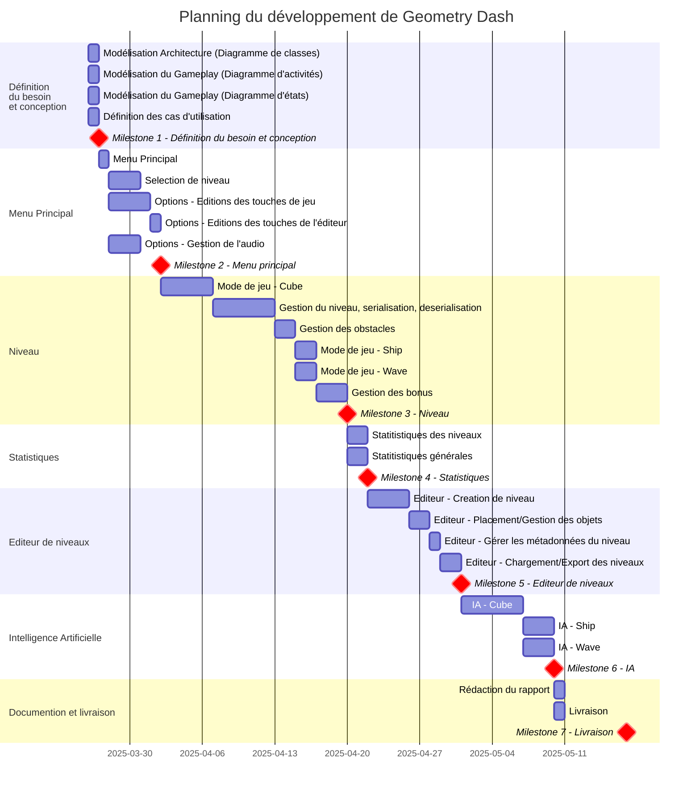

# Cnam_GeometryDash

## Gestion de projet

### Planification

Le projet à débuté le 26 mars 2025 et doit être livré le 17 mai 2025. Le planning est divisé en plusieurs étapes, chacune correspondant à une fonctionnalité ou un ensemble de fonctionnalités. Chaque étape est représentée par un milestone dans le diagramme de Gantt prévisionnel ci-dessous.



#### Outils de gestion de projet
Le projet est géré par le biais de la section Projects de Github. Ci dessous les liens vers le backlog et le tableau de gestion de projet.

- Backlog : [Github](https://github.com/users/OneLiberty/projects/3/views/4)
- Trello : [Github](https://github.com/users/OneLiberty/projects/3/views/5)


### Gestion de code source

#### Commits

Les commits suivent une covention de nommage pour faciliter la compréhension de l'historique du projet. Voici les conventions utilisées :

- ADD : Ajout de fonctionnalité
- CHG : Modification dans le comportement d'une méthode/classe
- FIX : Correction d'un bug
- REM : Suppression de fonctionnalité, méthode/classe ou de fichier
- DOC : Ajout de documentation
- REF : Refactoring de code

#### Branches

L'ajout de fonctionnalité est fait par le biais de branches. Chaque fonctionnalité est doit être idéalement développée dans une branche lui étant propre.
Les branches sont nommées de la manière suivante :

- INITIALE-NOM_DE_LA_FONCTIONNALITE

Les branches sont ensuite mergées dans la branche de developpement (dev) une fois la fonctionnalité terminée et testée. Le merge est fait par le biais d'une pull request. La pull request peut être reviewée par d'autres membres de l'équipe avant d'être mergée dans la branche. Il est recommandé de détailler le plus possible la pull request afin de faciliter la compréhension par les autres membres.

#### Review de code

Les pull requests sont reviewées par d'autres membres de l'équipe, a défaut copilot. Chaque membre peut commenter et suggérer des modifications. Il est important de prendre en compte les retours des autres membres et de les intégrer dans la branche.

#### Gestion des bugs

Les bugs sont gérés par le biais d'issues sur Github. Chaque bug est décrit de manière précise afin de faciliter la compréhension du problème, comment le reproduire et de proposer une solution. Les bugs sont ensuite assignés à un membre de l'équipe qui est responsable de la résolution du bug. L'issue peut être cloturée par un commit de type FIX en précisant le numéro de l'issue dans le message de commit, il est aussi possible de cloturer l'issue manuellement en ajoutant un commentaire précisant les commits qui ont permis de résoudre le bug.

## Conception

### Use-case diagram

### Activity diagram

### State diagram

### Class diagram

diagrammes (usecase, activity, state, class)

## Réalisation

blabla enjeux clé, difficulté

## Livraison

Lien vers la release
Explication sur le jeu, les contrôles...

```

```
